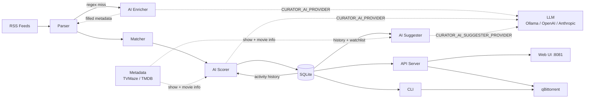

# 🎬 RSS Curator

A semi-automated torrent curator for private tracker RSS feeds with human-in-the-loop approval.

[](https://github.com/killakam3084/rss-curator/actions/workflows/build-and-push.yml)
[](https://codecov.io/gh/killakam3084/rss-curator)
[](https://goreportcard.com/report/github.com/killakam3084/rss-curator)
[](https://github.com/killakam3084/rss-curator/releases)
[](https://github.com/killakam3084/rss-curator/pkgs/container/rss-curator)
[](https://golang.org)

## Features

- ✅ Parse RSS feeds from private trackers (TV + optional separate movie feed)
- ✅ Intelligent metadata extraction (show name, season, episode, quality, codec, release group)
- ✅ Rule-based matching (quality filters, preferred codecs, release group preferences)
- ✅ SQLite-based staging system
- ✅ Integration with qBittorrent Web API
- ✅ Interactive CLI for approvals
- ✅ Batch operations support
- ✅ Docker containerization for easy deployment
- ✅ TrueNAS compatible setup
- ✅ Web UI dashboard (approve/reject queue, activity log, feed stream, AI score badges)
- ✅ AI-assisted scoring and metadata enrichment — Ollama (local), OpenAI-compatible, Anthropic Claude, or disabled
- ✅ Per-subsystem AI provider overrides — run Ollama for scoring and Anthropic only for suggestions simultaneously
- ✅ TV/movie metadata enrichment via TVMaze (free, default), TMDB, or TVDB with local cache
- ✅ Per-show rule configuration via `watchlist.json`
- ✅ AI scorer match confidence — separate signal for rule-vs-title plausibility with low-confidence UI badge
- ✅ Compact show-history summaries for AI scorer — token-efficient, recency-bias-free prompt context
- ✅ Ollama structured output — JSON Schema enforcement eliminating schema hallucination
- ✅ AI suggester — analyses accept/reject history to surface new show and movie recommendations
- ✅ Jobs system — background task tracking with live SSE updates and dedicated Jobs page
- ✅ Ephemeral alerts — in-browser notification ring (approve/reject/queue/staged/job_failed) with bell icon and unread badge
- ✅ In-app authentication — optional login page with session tokens and configurable TTL
- ✅ Settings page — manage `watchlist.json` rules and AI suggestions (accept/dismiss) from the Web UI

## Installation

### Prerequisites

- Go 1.22 or later
- qBittorrent with Web UI enabled
- SQLite3

### Build from source

```bash
git clone https://github.com/killakam3084/rss-curator
cd rss-curator
go build -o curator ./cmd/curator
```

### Install

```bash
# Copy to your PATH
sudo cp curator /usr/local/bin/
```

### Install using Docker

For containerized deployment (recommended for production and TrueNAS):

**Option 1: Using Docker Compose (easiest)**

```bash
# Copy and configure environment
cp curator.env.sample .env
vim .env

# Start the container
docker-compose up -d

# View logs
docker-compose logs -f
```

**Option 2: Using Docker directly**

```bash
# Build image
docker build -t rss-curator:latest .

# Run container
docker run --rm \
  --env-file .env \
  --network host \
  -v curator-data:/app/data \
  rss-curator:latest check
```

**Option 3: Using pre-built image from GitHub Container Registry**

```bash
# Pull the image
docker pull ghcr.io/killakam3084/rss-curator:latest

# Run with your configuration
docker run --rm \
  --env-file .env \
  --network host \
  -v curator-data:/app/data \
  ghcr.io/killakam3084/rss-curator:latest check
```

For more details, see [Container Guide](./docs/CONTAINER_GUIDE.md).

## Configuration

RSS Curator uses environment variables for configuration:

### Required Variables

```bash
export RSS_FEED_URL="https://your-tracker.com/rss?passkey=..."
export QBITTORRENT_USER="admin"
export QBITTORRENT_PASS="your-password"
```

### Optional Variables

```bash
# qBittorrent settings
export QBITTORRENT_HOST="http://localhost:8080"      # Default
export QBITTORRENT_CATEGORY="curator"                # Default
export QBITTORRENT_SAVEPATH="/path/to/downloads"     # Default: qBittorrent default

# Matching rules
export SHOW_NAMES="The Expanse,Foundation,Severance"
export MIN_QUALITY="1080p"                            # 720p, 1080p, 2160p
export PREFERRED_CODEC="x265"                         # x264, x265
export EXCLUDE_GROUPS="YIFY,RARBG"                    # Comma-separated
export PREFERRED_GROUPS="NTb,FLUX,HMAX"               # Comma-separated

# Storage
export STORAGE_PATH="$HOME/.curator.db"               # Default

# API server
export CURATOR_API_PORT=8081                          # Default

# AI provider (optional — omit to disable)
export CURATOR_AI_PROVIDER=ollama                     # ollama | openai | anthropic | disabled
export CURATOR_AI_HOST=http://localhost:11434          # Ollama/OpenAI-compatible base URL
export CURATOR_AI_MODEL=llama3.2                      # Model name (per-provider defaults apply)
export CURATOR_AI_KEY=                                # API key (OpenAI / Anthropic)

# Per-subsystem overrides (PROVIDER, KEY, and MODEL each fall back to the global value)
export CURATOR_AI_SUGGESTER_PROVIDER=anthropic        # e.g. Anthropic for suggestions only
export CURATOR_AI_SUGGESTER_KEY=sk-ant-...            # subsystem-specific key
export CURATOR_AI_SUGGESTER_MODEL=claude-haiku-4-5-20251001  # subsystem-specific model
```

### Metadata provider (optional)

```bash
# Provider: tvmaze (default, free), tmdb, tvdb, or disabled
export CURATOR_META_PROVIDER=tvmaze
export CURATOR_META_KEY=                              # Required for tmdb / tvdb
export CURATOR_META_TTL_HOURS=168                     # Cache TTL (default: 7 days)
```

### Authentication (optional)

```bash
export CURATOR_USERNAME=curator                       # Login page username (default: curator)
export CURATOR_PASSWORD=your-password                 # Enables login page when set
export CURATOR_SESSION_SECRET=change-me-long-random   # HMAC key; set for stable sessions
export CURATOR_SESSION_TTL_HOURS=24                   # Session lifetime (default: 24h)
```

### Create a config script

For convenience, create a `~/.curator.env` file:

```bash
#!/bin/bash
# RSS Curator Configuration

# Tracker RSS feed
export RSS_FEED_URL="https://your-tracker.com/rss?passkey=YOUR_PASSKEY"

# qBittorrent
export QBITTORRENT_HOST="http://localhost:8080"
export QBITTORRENT_USER="admin"
export QBITTORRENT_PASS="your-password"
export QBITTORRENT_CATEGORY="tv-shows"

# Shows to watch
export SHOW_NAMES="The Last of Us,House of the Dragon,Severance,Foundation"

# Quality preferences
export MIN_QUALITY="1080p"
export PREFERRED_CODEC="x265"

# Release groups
export PREFERRED_GROUPS="NTb,FLUX,HMAX,CMRG"
export EXCLUDE_GROUPS="YIFY"
```

Then source it before running:

```bash
source ~/.curator.env
curator check
```

## Usage

### Test Configuration

```bash
curator test
```

Output:
```
Testing connections...
qBittorrent... ✓ Connected
  Active torrents: 5
RSS feed 1... ✓ OK (47 items)
```

### Check for New Items

Scan RSS feeds and stage matches:

```bash
curator check
```

Output:
```
Checking RSS feeds...
Fetching: https://your-tracker.com/rss?passkey=...
Found 47 items
Matched 3 items

✓ Staged 3 new torrents
Run 'curator list' to review pending items
```

### List Staged Torrents

```bash
curator list              # Show pending (default)
curator list pending      # Show pending
curator list approved     # Show approved
curator list rejected     # Show rejected
```

Output:
```
ID  TITLE                                                   SIZE      REASON                          DATE
--  -----                                                   ----      ------                          ----
15  The.Last.of.Us.S02E03.1080p.WEB-DL.x265-NTb            2.1 GB    matches show: The Last of Us    Jan 24 14:32
14  Foundation.S03E08.2160p.WEB-DL.x265-FLUX               4.8 GB    matches show: Foundation        Jan 24 12:15
13  Severance.S02E01.1080p.WEB-DL.x264-HMAX                3.2 GB    matches show: Severance         Jan 23 22:10
```

### Approve Torrents

Approve specific torrents by ID:

```bash
curator approve 15 14
```

Output:
```
Adding: The.Last.of.Us.S02E03.1080p.WEB-DL.x265-NTb
✓ Approved torrent 15
Adding: Foundation.S03E08.2160p.WEB-DL.x265-FLUX
✓ Approved torrent 14
```

### Reject Torrents

```bash
curator reject 13
```

### Interactive Review Mode

Review all pending torrents interactively:

```bash
curator review
```

Output:
```
[1/3] The.Last.of.Us.S02E03.1080p.WEB-DL.x265-NTb
      Size: 2.1 GB | Match: matches show: The Last of Us, quality: 1080p, preferred codec: x265
      Link: https://tracker.com/download/12345.torrent
      (a)pprove / (r)eject / (s)kip: a
✓ Approved

[2/3] Foundation.S03E08.2160p.WEB-DL.x265-FLUX
      Size: 4.8 GB | Match: matches show: Foundation, quality: 2160p, preferred group: FLUX
      Link: https://tracker.com/download/12346.torrent
      (a)pprove / (r)eject / (s)kip: s
Skipped

...

Review complete!
```

### Web UI

Start the HTTP API server and access the dashboard in your browser:

```bash
curator serve
```

Open `http://localhost:8081` to approve/reject torrents, view the activity log, check stats, and browse the raw feed stream. AI score badges (`⚡ N%`) appear on each card when scoring is enabled. Port is configurable via `CURATOR_API_PORT`.

## Automation

### Cron Job

Add to your crontab to check feeds every 30 minutes:

```bash
crontab -e
```

Add:
```bash
*/30 * * * * source ~/.curator.env && /usr/local/bin/curator check >> ~/.curator.log 2>&1
```

### Systemd Timer (Recommended)

Create `/etc/systemd/system/curator.service`:

```ini
[Unit]
Description=RSS Curator Check
After=network.target

[Service]
Type=oneshot
User=your-username
EnvironmentFile=/home/your-username/.curator.env
ExecStart=/usr/local/bin/curator check
```

Create `/etc/systemd/system/curator.timer`:

```ini
[Unit]
Description=RSS Curator Timer
Requires=curator.service

[Timer]
OnBootSec=5min
OnUnitActiveSec=30min

[Install]
WantedBy=timers.target
```

Enable and start:

```bash
sudo systemctl enable curator.timer
sudo systemctl start curator.timer
```

Check status:

```bash
systemctl status curator.timer
journalctl -u curator.service
```

## Architecture



Full diagrams (state machine, ER model, component map): [docs/ARCHITECTURE.md](./docs/ARCHITECTURE.md)

### Components

- **Parser** (`internal/feed`): Fetches and parses RSS feeds, extracts metadata via regex
- **AI Enricher** (`internal/ai`): LLM fallback to fill `ShowName`/`Season` when regex fails — silent no-op when unavailable
- **Matcher** (`internal/matcher`): Applies show/quality/codec/group rules
- **AI Scorer** (`internal/ai`): Scores matches 0–1 against approve/reject history — silent no-op when unavailable
- **AI Suggester** (`internal/suggester`): Analyses accept/reject history to surface new show and movie recommendations; results accumulate until dismissed or added to `watchlist.json`
- **Metadata** (`internal/metadata`): TV and movie metadata providers (TVMaze, TMDB); shared local SQLite cache with configurable TTL
- **Storage** (`internal/storage`): SQLite staging queue + activity log + raw feed stream + jobs table
- **Log Buffer** (`internal/logbuffer`): In-memory ring buffer for logs, jobs fan-out, and alerts fan-out via SSE
- **Ops** (`internal/ops`): Orchestrates compound operations — feed check, rematch, rescore, rescore-backfill — used by both CLI and scheduler
- **Settings** (`internal/settings`): Runtime-configurable app settings backed by SQLite; surfaced via the Settings page
- **Scheduler** (`internal/scheduler`): Periodic background task runner (feed check interval)
- **API Server** (`internal/api`): REST API + serves Web UI; jobs and alerts SSE endpoints; alert poller; started with `curator serve`
- **Web UI** (`web/`): Vue.js dashboard for approvals, activity, stats, feed stream, suggestions, and settings; top nav with jobs badge and alerts bell
- **qBittorrent Client** (`internal/client`): Wrapper around qBittorrent Web API

## Development

### Project Structure

```
rss-curator/
├── cmd/curator/main.go        # CLI entry point, all command dispatch
├── internal/
│   ├── ai/                    # Provider interface, Enricher, Scorer, History aggregator
│   ├── api/                   # HTTP API server, jobs/alerts SSE, alert poller
│   ├── client/                # qBittorrent Web API client
│   ├── feed/                  # RSS fetch + regex metadata extraction
│   ├── jobs/                  # Job record helpers
│   ├── logbuffer/             # In-memory ring buffer (logs, jobs, alerts)
│   ├── matcher/               # Rule-based matching
│   ├── metadata/              # TV/movie metadata providers (TVMaze, TMDB) + cache
│   ├── ops/                   # Compound operations (feedcheck, rematch, rescore)
│   ├── scheduler/             # Periodic background task runner
│   ├── settings/              # Runtime settings backed by SQLite
│   ├── storage/               # Store interface + SQLite implementation
│   └── suggester/             # AI suggestion engine (shows + movies)
├── pkg/models/types.go        # Shared value types (incl. JobRecord, AlertRecord)
├── web/                       # Vue.js dashboard
│   ├── index.html             # Main queue + activity dashboard
│   ├── jobs.html              # Standalone jobs page
│   ├── login.html             # Authentication page
│   ├── settings.html          # Settings + suggestions management
│   ├── app.js / settings.js   # Page controllers
│   └── style.css
├── docs/                      # Reference documentation
├── scripts/                   # Container entrypoint + scheduler
├── go.mod
└── README.md
```

### Running Tests

```bash
go test ./...
```

### Building

```bash
go build -o curator ./cmd/curator
```

### Cross-compilation

```bash
# Linux
GOOS=linux GOARCH=amd64 go build -o curator-linux-amd64 ./cmd/curator

# macOS
GOOS=darwin GOARCH=arm64 go build -o curator-darwin-arm64 ./cmd/curator
```

## Roadmap

- [x] AI scorer `match_confidence` signal — rule-vs-title plausibility score with UI badge
- [x] Jobs system — background task tracking, SSE fan-out, standalone Jobs page
- [x] Ephemeral alerts — in-memory ring, SSE, bell UI, localStorage unread tracking
- [x] Compact show-history summaries — token-efficient scorer context, eliminates recency bias
- [x] Ollama structured output — JSON Schema enforcement, `num_ctx`/`num_predict` configurable
- [x] Suggester engine — AI-powered show and movie recommendations derived from accept/reject history
- [x] Movie support — separate movie RSS feed, movie suggestions, TMDB movie metadata
- [x] Cloud LLM providers — Anthropic Claude and OpenAI alongside Ollama
- [x] Per-subsystem AI provider overrides — mix local and cloud inference independently
- [x] Metadata enrichment — TVMaze/TMDB providers with local SQLite cache
- [x] In-app authentication — login page, session tokens, configurable TTL
- [ ] YAML configuration file support
- [ ] Webhook notifications (on approve/stage)
- [ ] Season pack handling
- [ ] Custom metadata extraction patterns
- [ ] Multi-tracker aggregate feed support
- [ ] Candidate-focused retrieval — embeddings or fuzzy matching to select the most relevant history summaries for a candidate at score time
- [ ] App-level Prometheus metrics — expose `/metrics` endpoint; track scorer latency, error rate, clamp frequency

## Troubleshooting

### qBittorrent Connection Failed

Ensure Web UI is enabled:
1. Open qBittorrent
2. Tools → Options → Web UI
3. Enable "Web User Interface"
4. Set username/password
5. Note the port (default: 8080)

### RSS Feed Returns 403

Your RSS feed URL may have expired. Generate a new one from your tracker's settings.

### No Items Matched

Check your matching rules:
```bash
# Debug mode (coming soon)
curator check --debug
```

Verify your `SHOW_NAMES` includes the shows you want.

## License

MIT

## Contributing

Contributions welcome! Please open an issue or PR.

## Acknowledgments

- [autobrr/go-qbittorrent](https://github.com/autobrr/go-qbittorrent) - qBittorrent API client
- [mattn/go-sqlite3](https://github.com/mattn/go-sqlite3) - SQLite driver

---

Built with ❤️ for private tracker enthusiasts
