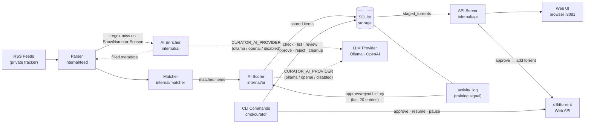
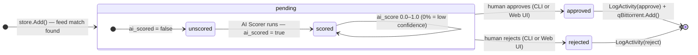
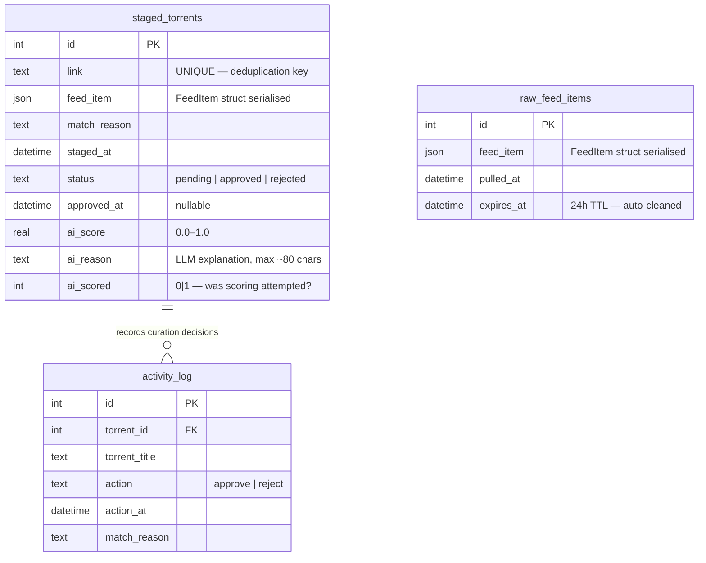

# Architecture

This document describes the system topology, data model, and state machine for RSS Curator.

---

## System Topology



**Key design decisions:**

- The AI provider is **optional** — a `noopProvider` is used when `CURATOR_AI_PROVIDER=disabled` or the host is unreachable. All downstream code is unaffected.
- The **Enricher** only fires when regex metadata extraction leaves `ShowName` or `Season` empty — it fills gaps silently and never blocks the pipeline.
- The **Scorer** uses the `activity_log` as its training signal. It only reads *curatorial judgments* (approve/reject), not operational outcomes like download status. This keeps the signal clean.
- The **API Server** and **CLI** are parallel interfaces to the same `storage.Store` interface — the server is an optional mode started with `curator serve`.

---

## Torrent State Machine



**Diagram legend:**

| Symbol | Meaning |
|---|---|
| `[*] →` | Entry point — where the state machine starts |
| `→ [*]` | Terminal point — where the state machine ends |
| Rounded rectangle | State |
| Nested block | Composite state — contains its own internal sub-states and transitions |
| `→ label` | Transition — event or action that moves between states |
| Self-loop `↺` | Internal transition — state remains the same, value changes |

**State semantics:**

| State | `ai_scored` | `ai_score` | Meaning |
|---|---|---|---|
| `pending` | `false` | `0.0` | Staged, not yet scored — eligible for backfill |
| `pending` | `true` | `0.0` | Scored, genuinely low confidence |
| `pending` | `true` | `0.85` | Scored, high confidence — shown as `⚡ 85%` in UI |
| `approved` | any | any | Human approved; `LogActivity` + qBit add executed |
| `rejected` | any | any | Human rejected; `LogActivity` executed |

The `ai_scored` flag is the authoritative "was scoring attempted" marker — `ai_score=0.0` alone is ambiguous. Every `UpdateAIScore()` call sets `ai_scored = 1` regardless of the returned score value.

**Backfill:** On every `curator check` run, if the AI provider is available, all torrents with `ai_scored=false` (any status) are re-scored. This ensures torrents staged before Ollama/OpenAI was configured are retroactively enriched.

---

## Data Model



**Table notes:**

- `staged_torrents.link` is the deduplication key — `INSERT OR IGNORE` means re-running `check` on the same feed is always safe.
- `feed_item` columns in both `staged_torrents` and `raw_feed_items` are serialised JSON blobs of the `models.FeedItem` struct (title, size, quality, codec, release group, etc.).
- `activity_log` is append-only and is the Scorer's training corpus. It records only human curation intent, never operational download state.
- `raw_feed_items` is a 24-hour sliding window of everything the RSS parser saw, regardless of whether it matched. It powers the `/api/feed/stream` endpoint (feed discovery visibility in the Web UI).
- Schema migrations are idempotent `ALTER TABLE IF NOT EXISTS` statements — safe to run against existing databases on upgrade.

---

## Package Map

```
cmd/curator/
  main.go           CLI entry point, all command dispatch, cmdCheck pipeline

internal/
  ai/
    provider.go     Provider interface + OllamaProvider, OpenAIProvider, noopProvider
    enricher.go     LLM metadata fallback (ShowName / Season gap fill)
    scorer.go       Approval probability scorer (0.0–1.0) against activity history
  api/
    server.go       HTTP API server, all handlers, JSON response types
  client/
    qbittorrent.go  qBittorrent Web API client wrapper
  feed/
    parser.go       RSS fetch + parse + regex metadata extraction
  matcher/
    matcher.go      Rule-based show/quality/codec/group matching
  storage/
    storage.go      Store interface + SQLite implementation, all migrations

pkg/models/
  types.go          Shared value types: FeedItem, StagedTorrent, Activity, ShowsConfig, Config

web/
  index.html        Vue.js single-page dashboard
  app.js            Vue 3 application logic
  style.css         Tailwind-based styles
```
